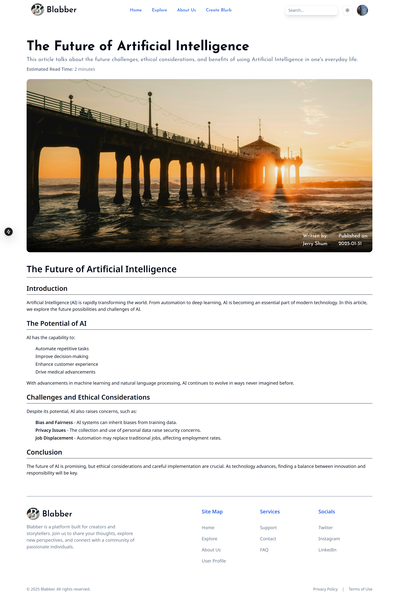
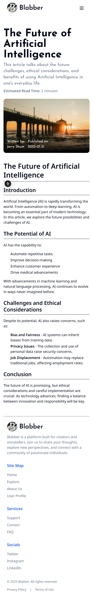
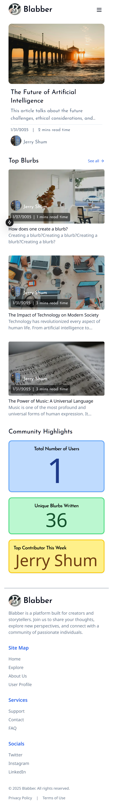
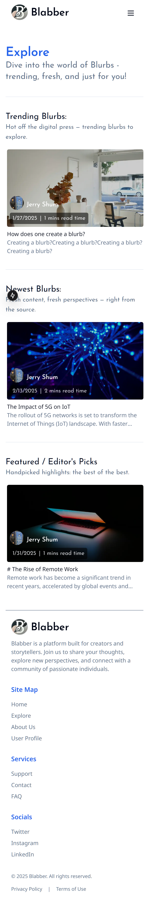
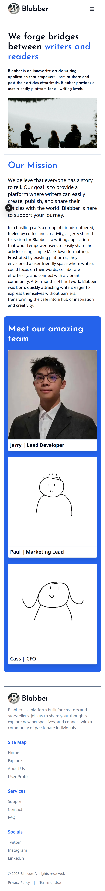

# Blabber

A modern blogging platform built with Next.js that allows users to share their thoughts and stories.

## Technologies & Skills Learned

- **Next.js 15** - App Router, Server Components, and Server Actions
- **Authentication** - Implemented user authentication using auth.js along with some forms of session management
- **Database Management** - Used Prisma ORM with SQLite database
- **Schema Validation** - Implemented Zod for type-safe form validation
- **Modern UI/UX** - Built responsive interfaces using TailwindCSS
- **TypeScript** - Leveraged strong typing for better code reliability
- **Migrations** - Managed database schema changes through Prisma migrations
- **Content Management** - Built features for creating and managing blog posts with titles, descriptions, and estimated read times

## Key Features

- User authentication
- Blog post creation with rich content support
- Estimated reading time calculation
- Responsive design
- Type-safe form submissions
- Dark mode support

## Development Setup

1. Clone the repository
2. Install dependencies:

```bash
npm install
```

3. Setup the database and run migrations:

```bash
npx prisma migrate dev
```

4. Start the development server:

```bash
npm run dev
```

5. Open your browser and navigate to `http://localhost:3000`
6. Have fun!

## What I Learned

Through Blabber, I gained practical experience with:

- **Next.js 15** - I learned how to use the new features of Next.js 15, including the App Router, Server Components, and Server Actions.
- **Authentication** - I implemented user authentication using auth.js, which allowed me to understand the basics of user authentication and session management.
- **Database Management** - I used Prisma ORM with SQLite to manage the database schema and perform CRUD operations.
- **Schema Validation** - I learned how to use Zod for type-safe form validation, ensuring that user input is validated before being processed.
- **Modern UI/UX** - I built responsive interfaces using TailwindCSS, enhancing the overall user experience.
- **TypeScript** - I leveraged strong typing for better code reliability and maintainability.
- **Content Management** - I built features for creating and managing blog posts, including titles, descriptions, and estimated read times.

## Future Improvements

- **User Profiles** - Implement user profiles to allow users to customize their profiles and manage their blogs.
- **Commenting System** - Add a commenting system to allow users to engage with blog posts and discussions.
- **Search Functionality** - Implement a search functionality to allow users to find specific blog posts.
- **Analytics** - Add analytics to track user engagement and blog post performance.

## Screenshots

### Read Blurb Page




### Homepage




### Explore Page




### About Page



